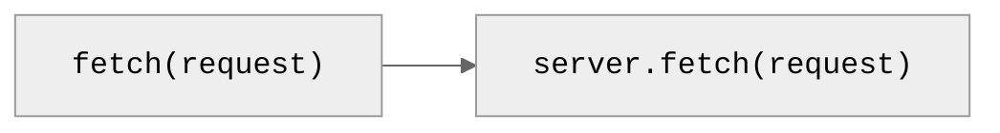
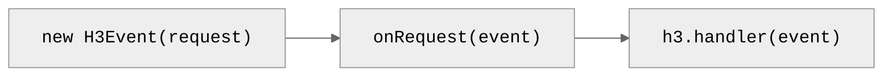
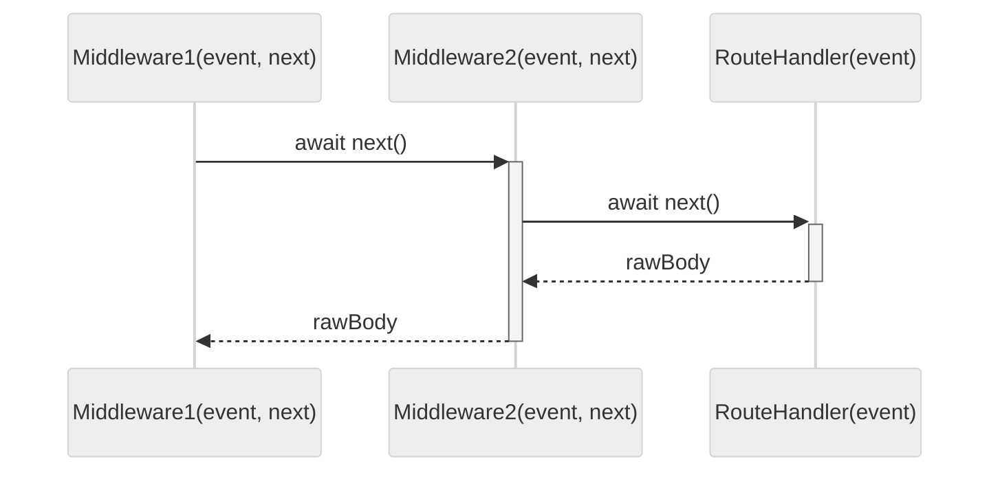
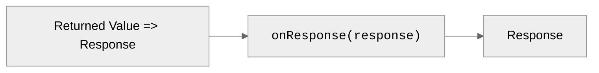

# Request Lifecycle

> H3 dispatches incoming web requests to final web responses.

Below is an overview of what happens in a H3 server from when an HTTP request arrives until a response is generated.

## 1. Incoming Request

When An HTTP request is made by Browser or [fetch()](https://developer.mozilla.org/en-US/docs/Web/API/Fetch_API), server fetch handler receives a [Request](https://developer.mozilla.org/en-US/docs/Web/API/Request) object.

> [!TIP]
> ​[💥 Srvx](https://srvx.h3.dev) provides unified `server.fetch` interface and adds [Node.js compatibility](https://srvx.h3.dev/guide/node).

## 2. Accept Request

H3 Initializes an [`H3Event`](/guide/api/h3event) instance from incoming request, calls [`onRequest`](/guide/api/h3#global-hooks) global hook and finally [`H3.handler`](/guide/api/h3#h3handler) with the initialized event.

## 3. Dispatch Request

H3 [matches route](/guide/basics/routing) based on `request.url` and `request.method`, calls global [middleware](/guide/basics/middleware) and finally matched route handler function with event.

> [!TIP]
> 🚀 Internally, H3 uses srvx `FastURL` instead of `new URL(req.url).pathname`.

## 4. Send Response

H3 [converts](/guide/basics/response#response-types) returned value and [prepared headers](/guide/basics/response#preparing-response) into a [Response](https://developer.mozilla.org/en-US/docs/Web/API/Response), calls [`onResponse`](/guide/api/h3#global-hooks) global hook and finally returns response back to the server fetch handler.

