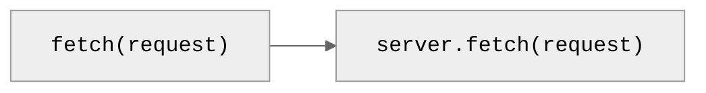
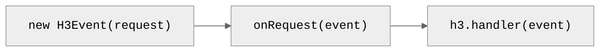
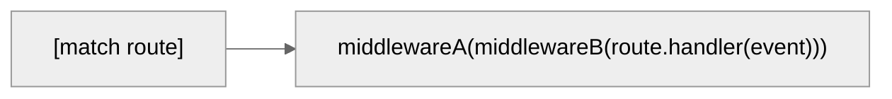
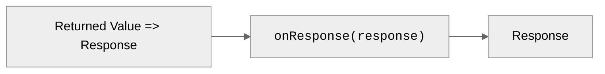

# 请求生命周期

> H3 将传入的网络请求分派到最终的网络响应。

以下是 H3 服务器中从 HTTP 请求到达到生成响应的整个过程概览。

## 1. 传入请求

当浏览器或 [fetch()](https://developer.mozilla.org/en-US/docs/Web/API/Fetch_API) 发起 HTTP 请求时，服务器的 fetch 处理器会接收一个 [Request](https://developer.mozilla.org/en-US/docs/Web/API/Request) 对象。

> [!TIP]
> ​[💥 Srvx](https://srvx.h3.dev) 提供统一的 `server.fetch` 接口并增加了 [Node.js 兼容性](https://srvx.h3.dev/guide/node)。

## 2. 接受请求

H3 从传入请求初始化一个 [`H3Event`](/guide/api/h3event) 实例，调用 [`onRequest`](/guide/api/h3#global-hooks) 全局钩子，最后调用初始化好的事件的 [`H3.handler`](/guide/api/h3#h3handler)。

## 3. 分派请求

H3 根据 `request.url` 和 `request.method` [匹配路由](/guide/basics/routing)，调用全局 [中间件](/guide/basics/middleware)，最终调用匹配到的路由处理函数并传入事件。

> [!TIP]
> 🚀 在内部，H3 使用 srvx 的 `FastURL` 替代 `new URL(req.url).pathname`。

## 4. 发送响应

H3 将返回的值和 [准备好的头部信息](/guide/basics/response#preparing-response) 转换成一个 [Response](https://developer.mozilla.org/en-US/docs/Web/API/Response)，调用 [`onResponse`](/guide/api/h3#global-hooks) 全局钩子，最后将响应返回给服务器的 fetch 处理器。

